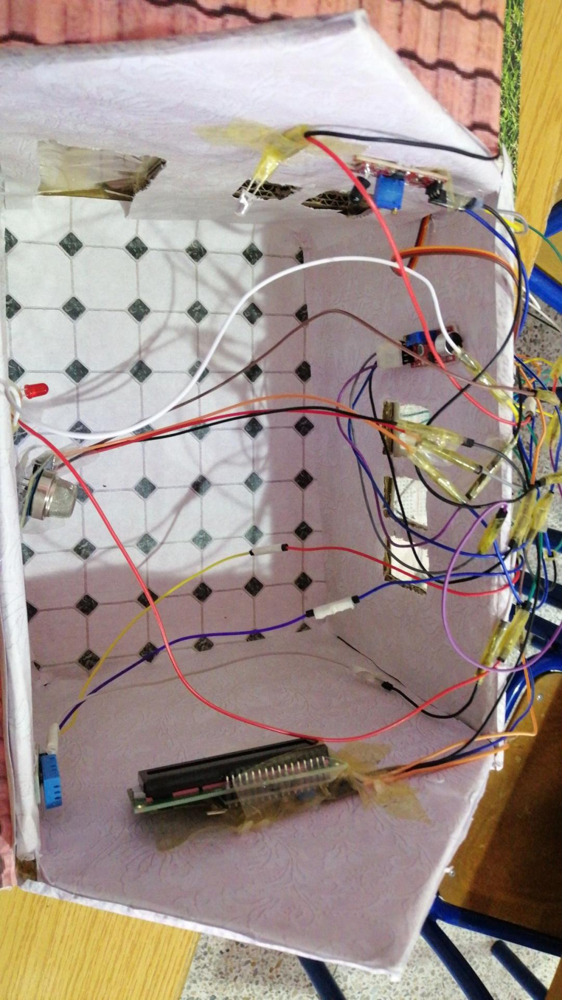

# SMART HOUSE – Projet Arduino

Système domotique articulé autour d’un circuit **intérieur** et d’un circuit **extérieur**, intégrant un ensemble de capteurs et d’actionneurs destinés à assurer sécurité, automatisation et confort. Les éléments décrits ci-dessous s’appuient sur la documentation technique Arduino, des références en systèmes embarqués et des dispositifs de détection couramment utilisés dans les environnements domotiques.

---

## Photographies du prototype

### Vue extérieure

### Vue intérieure

---

## Circuit intérieur

Module conçu pour analyser l’environnement immédiat et réagir à des phénomènes critiques : pluie, flamme, fumée, bruit, température et humidité. L’ensemble des capteurs est couramment employé dans les systèmes de surveillance domestique et dans la détection de phénomènes potentiellement dangereux.

### Capteurs

* Capteur de pluie (A0) : mesure de l’humidité de surface et détection de la pluie.
* Capteur de flamme (A1) : détection du rayonnement spécifique d’une flamme.
* Capteur MQ-2 (A2) : détection de fumée et gaz inflammables.
* Capteur sonore (D2) : détection d’impulsions sonores nettes.
* DHT11 (D4) : mesure de la température et de l’humidité ambiante.

### Actionneurs et sorties

* Servomoteur (D10) : repli automatique du linge en cas de pluie.
* Buzzer (D5) : alarme sonore en cas de présence de flamme.
* LED rouge (D6) : indication de fumée détectée.
* LED blanche (D7) : clignotement en réponse aux bruits.
* Écran LCD I2C (0x27) : affichage des mesures ou des alertes.

### Logique de fonctionnement

1. Pluie < 500 → orientation du servomoteur à 180° (protection du linge).
2. Flamme détectée (<500) → activation du buzzer à 1000 Hz.
3. Fumée > 300 → activation de la LED rouge.
4. Son détecté (HIGH) → bascule de la LED blanche.
5. Affichage LCD :

   * alertes prioritaires en cas de feu ou fumée,
   * sinon affichage de la température (°C) et de l’humidité (%).

Code associé : `Interior_SMART_HOUSE.ino`

---

## Circuit extérieur

Module destiné à la détection de présence, à l’éclairage automatique, à la gestion de la porte de garage et à l’orientation du panneau solaire. Les principes utilisés relèvent de la détection ultrasonique, de la photorésistance et de l’asservissement simple.

### Capteurs

* Deux capteurs ultrasoniques (TRIG/ECHO) :

  * Détection d’un véhicule ou d’une personne sur la voie d’accès.
  * Détection d’un obstacle proche dans le garage (<10 cm).
* Trois capteurs LDR (A0, A1, A2) :

  * A0 : évaluation du niveau d’obscurité.
  * A1/A2 : comparaison gauche/droite pour le suivi solaire.

### Actionneurs

* LEDs (D6, D7) : éclairage automatique.
* Servomoteur de porte (D9) : ouverture et fermeture du garage.
* Servomoteur solaire (D10) : orientation du panneau solaire selon la luminosité.

### Logique de fonctionnement

1. Obscurité + présence voie (>800) → activation de l’éclairage pendant 6 secondes.
2. Distance garage < 10 cm → ouverture de la porte à 90°, fermeture après 3 secondes.
3. Suivi solaire → orientation du servomoteur en fonction de l’écart lumineux LDR gauche/droite.

Code associé : `Exterieur_SMART_HOUSE.ino`

---

## Synthèse des fonctionnalités

* Détection de la pluie et protection automatique du linge.
* Détection de flamme et de fumée, avec alertes dédiées.
* Détection sonore et signalisation visuelle.
* Affichage en temps réel des données environnementales.
* Détection extérieure de véhicule ou de présence.
* Éclairage automatique en conditions d’obscurité.
* Ouverture intelligente et temporisée du garage.
* Orientation automatique d’un panneau solaire.
